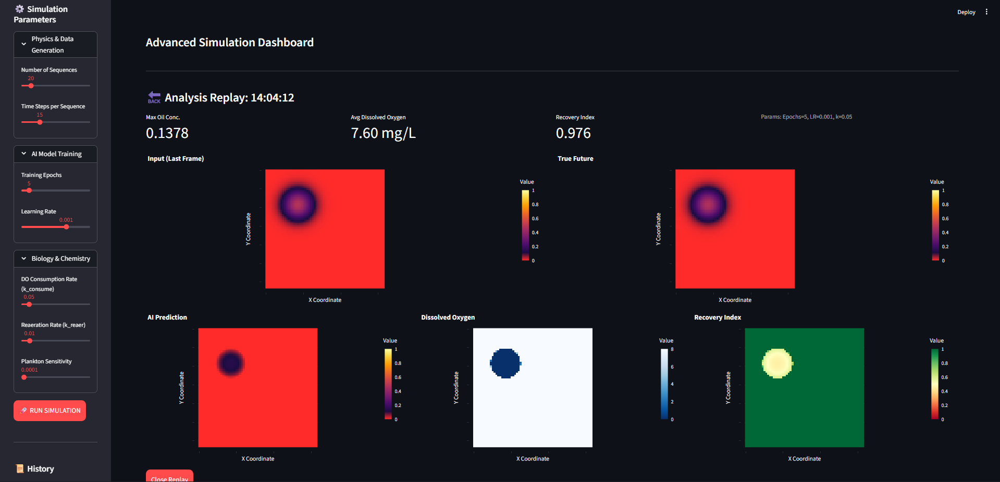

# AI Oil Spill Modeling & Ecological Impact

This project is an advanced dashboard application built with **Streamlit** and **PyTorch**. It allows simulating oil spill propagation, predicting its movement using an AI model (ConvLSTM), and analyzing the resulting ecological impact on the marine ecosystem.



## Description

The application combines physical modeling, artificial intelligence, and biological analysis to provide a comprehensive overview of an oil spill incident. It is designed to be interactive, allowing users to configure simulation parameters, train the AI model in real-time, and visualize ecological consequences.

## Main Features

- **1. Physics Simulation:**

  - Generation of synthetic data to simulate fluid dynamics and oil propagation.
  - Configurable parameters for the number of sequences and time steps.

- **2. AI Prediction (Deep Learning):**

  - Utilization of a **ConvLSTM** (Convolutional Long Short-Term Memory) model to predict the future evolution of the oil spill.
  - Live model training via the interface with loss curve visualization.
  - Hyperparameter tuning (epochs, learning rate).

- **3. Ecological Impact Analysis:**

  - Calculation of **Dissolved Oxygen (DO)** levels based on bacterial consumption of oil.
  - Estimation of **Plankton** survival in response to toxicity.
  - Calculation of a global **Ecological Recovery Index**.

- **4. Interactive Visualization:**

  - Interactive heatmaps with **Plotly** for data exploration (zoom, hover).
  - Visual comparison between ground truth (physics) and AI prediction.
  - Visualization of biological metrics (DO, Recovery).

- **5. Simulation History:**
  - Automatic saving of results for each simulation.
  - Ability to reload and review past analyses from the sidebar.

## Installation

1.  Ensure Python is installed.
2.  Clone this repository.
3.  Install the necessary dependencies using `requirements.txt`:

```bash
pip install -r requirements.txt
```

_Note: The project requires `streamlit`, `torch`, `plotly`, `numpy`, and `pandas` among others._

## Usage

To launch the application, run the following command in your terminal at the project root:

```bash
streamlit run app.py
```

The application will automatically open in your default browser.

## Project Structure

- `app.py`: The main entry point of the Streamlit application. Contains the interface logic and step orchestration.
- `data/`: Contains scripts for synthetic data generation (`make_synthetic_data.py`).
- `ai_predictor/`: Contains the Deep Learning model architecture (`model_conv_lstm.py`).
- `utils/`: Contains utility functions for biological calculations (`biology_ops.py`).
- `images/`: Folder for image resources (e.g., screenshots).
- `requirements.txt`: List of required Python libraries.

---

_Developed for marine environmental risk analysis and prediction._
